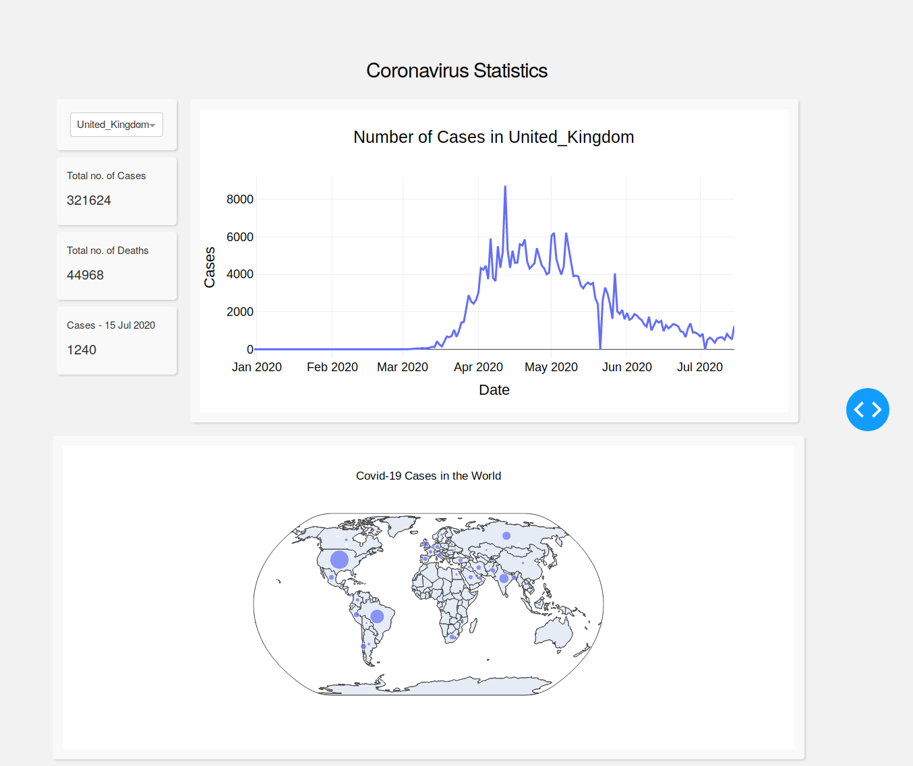

# Dashboard-COVID19
This project shows step by step how to create a dashboard using coronavirus dataset. 
In the dashboard, there are 2 tabs. First tab shows a data table. Second tab shows 2 different visuals; a garphic of number of
cases for each day for the selected country and a world map of coronavirus cases.

### Data
Coronavirus dataset : involves number of cases and deaths per country on daily basis.

### Used Libraries
* pandas
* plotly
* dash

### Visual of Dashboard

### Sources
1. [EU Open Data Portal - COVID-19 Coronavirus Data ](https://data.europa.eu/euodp/en/data/dataset/covid-19-coronavirus-data)
